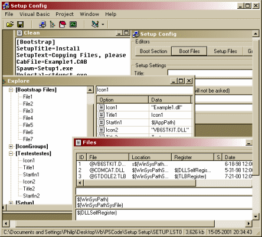



## Setup Config v\. 0\.8\.6

### Description

by "Package & Deployment Wizard", that follows with VB (I think will all versions).___

What it does is it edits the setup.lst file, that controls the whole setup process. There is a few functions that you can't do in the standard setup creator.___

---NEW---

Well I have updated this, so now almost every function works (even though few dosn't have many functions).

But now you can actualy use it as a program, it supports so much that it's great for you'r setup projects.

I have added some new utilities, a great date editor, to make it all look a little more pro.
 
### More Info
 

             |
---                |---
**Submitted On**   |2001-06-14 20:00:40
**By**             |[Philip Birk\-Jensen](https://github.com/Planet-Source-Code/PSCIndex/blob/master/ByAuthor/philip-birk-jensen.md)
**Level**          |Beginner
**User Rating**    |4.3 (13 globes from 3 users)
**Compatibility**  |VB 5\.0, VB 6\.0
**Category**       |[Complete Applications](https://github.com/Planet-Source-Code/PSCIndex/blob/master/ByCategory/complete-applications__1-27.md)
**World**          |[Visual Basic](https://github.com/Planet-Source-Code/PSCIndex/blob/master/ByWorld/visual-basic.md)
**Archive File**   |[Setup Conf211856152001\.zip](https://github.com/Planet-Source-Code/philip-birk-jensen-setup-config-v-0-8-6__1-24106/archive/master.zip)

